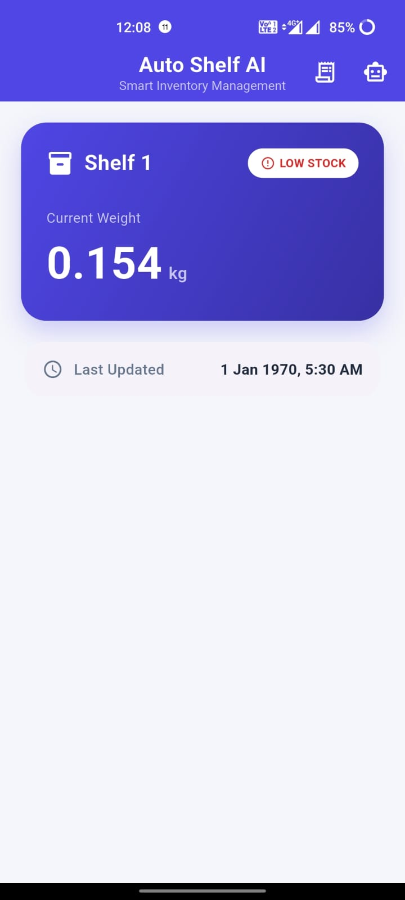
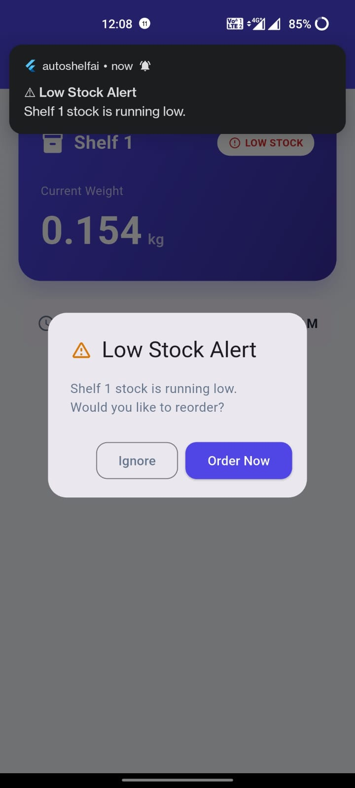
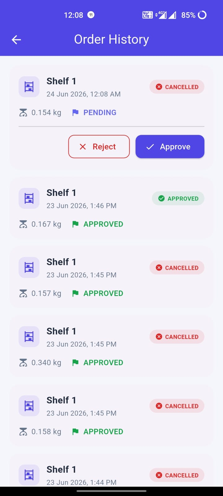
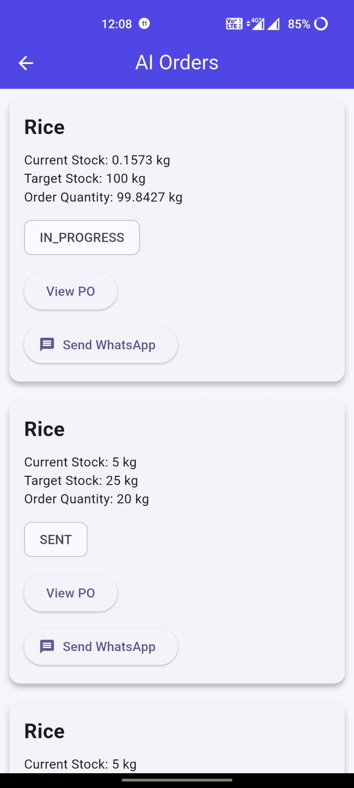

# 📦 AutoShelf AI

An AI-powered smart inventory monitoring and autonomous purchasing system that combines IoT sensors, artificial intelligence, real-time databases, and automated supplier communication.

AutoShelf AI continuously monitors inventory levels and intelligently generates purchase orders when stock becomes low, enabling smarter and faster inventory management.

---

# 🚀 Overview

AutoShelf AI is a smart inventory management platform built using Flutter, Firebase, ESP32, HX711 load sensors, Google Gemini AI, and WhatsApp automation.

The system continuously monitors product stock levels using load sensors. When stock falls below a predefined threshold, AutoShelf AI automatically generates purchase orders and communicates with suppliers.

---

# ✨ Features

## 📊 Real-Time Inventory Monitoring

* ESP32 + HX711 load cell integration.
* Real-time stock updates.
* Firebase Realtime Database synchronization.
* Live inventory weight monitoring.

## 🔔 Smart Notifications

* Low stock alerts.
* Local push notifications.
* Stock warning dialogs.
* Reorder recommendations.

## 🤖 AI Purchase Order Generation

* Google Gemini AI integration.
* Automatic reorder quantity calculation.
* Intelligent stock analysis.
* Professional purchase order generation.

## 📱 Flutter Dashboard

* Live inventory monitoring.
* Product status visualization.
* Weight tracking.
* Stock status indicators.

## 📜 Order Management

* Approve orders.
* Reject orders.
* Order history tracking.
* Timestamp management.

## 🧠 AI Orders

* AI-generated purchase orders.
* Reorder quantity recommendations.
* Purchase order storage.
* Supplier communication records.

## 💬 Supplier Communication

* WhatsApp supplier integration.
* Automatic order delivery.
* Delivery confirmation workflow.
* AI-assisted supplier communication.

---

# 🛠️ Technology Stack

### Mobile Application

* Flutter
* Dart

### Backend & Database

* Firebase Realtime Database
* Firebase Core

### Artificial Intelligence

* Google Gemini AI

### Hardware

* ESP32
* HX711 Load Cell Amplifier
* Load Cell Sensor

### Automation

* Node.js
* WhatsApp Automation (Baileys)

### Notifications

* Flutter Local Notifications

---

# 📂 System Architecture

```text
ESP32 + Load Cell
        ↓
Firebase Realtime Database
        ↓
Flutter Application
        ↓
Gemini AI Engine
        ↓
AI Purchase Order
        ↓
WhatsApp Supplier Agent
```

---

# 🔥 Workflow

1. Product stock decreases.
2. ESP32 measures weight.
3. Weight data is sent to Firebase.
4. Flutter detects low stock.
5. User approves reorder.
6. Gemini AI generates purchase order.
7. AI order is created.
8. Supplier communication begins.
9. Delivery confirmation is received.

---

# 📦 Hardware Components

* ESP32 Development Board
* HX711 Amplifier Module
* Load Cell Sensor
* 5V Power Supply

---

# 📱 Application Screenshots

## Dashboard



## Low Stock Notification



## Order History



## AI Orders



---

# 🚀 Future Improvements

* Multi-supplier support.
* Supplier comparison.
* AI negotiation system.
* Delivery tracking.
* Automatic supplier selection.
* Predictive inventory analysis.
* Inventory demand forecasting.
* Agentic AI purchasing decisions.

---

# 👨‍💻 Developer

**Muhammed Hafsal**

IoT Engineer • Embedded Systems Enthusiast • AI Applications Developer

---

# 📄 License

This project is developed for educational, research, and innovation purposes.

---

⭐ If you find this project useful, consider giving it a star on GitHub.
